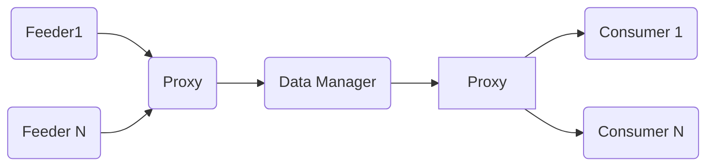

# Introduction
The goal of this project is to propose a multi-feeder multi-consumer data management framework. 



## Architecture

### Proxy 
The proxy implements / will implement several classes that can be used as interface with the Feeders: 

* TCPServer
* UDP 
* Local
* Bypass

### Data Manager

The data manager buffers the data and handles its forwarding from the feeders to the consumers. There are 3 modes:

* Broadcast mode : every data fed at the input is broadcast to all the consumers
* Known map: a route is defined between the consumers and the feeders
* Topic Map

# Build
```
mkdir build && cd build
cmake ..
make
```
